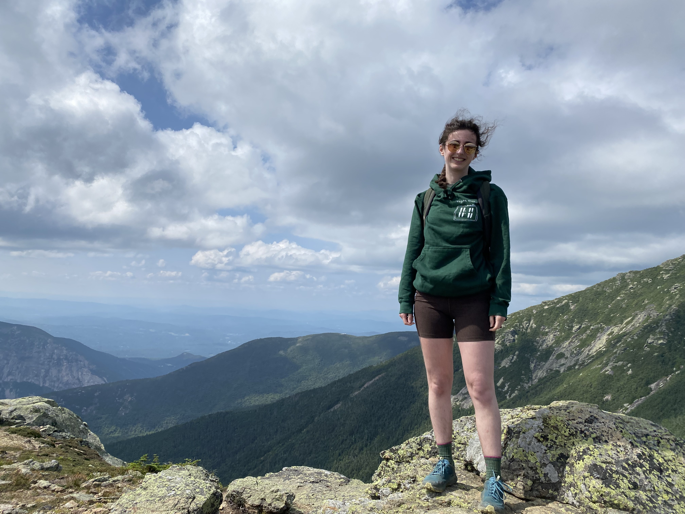
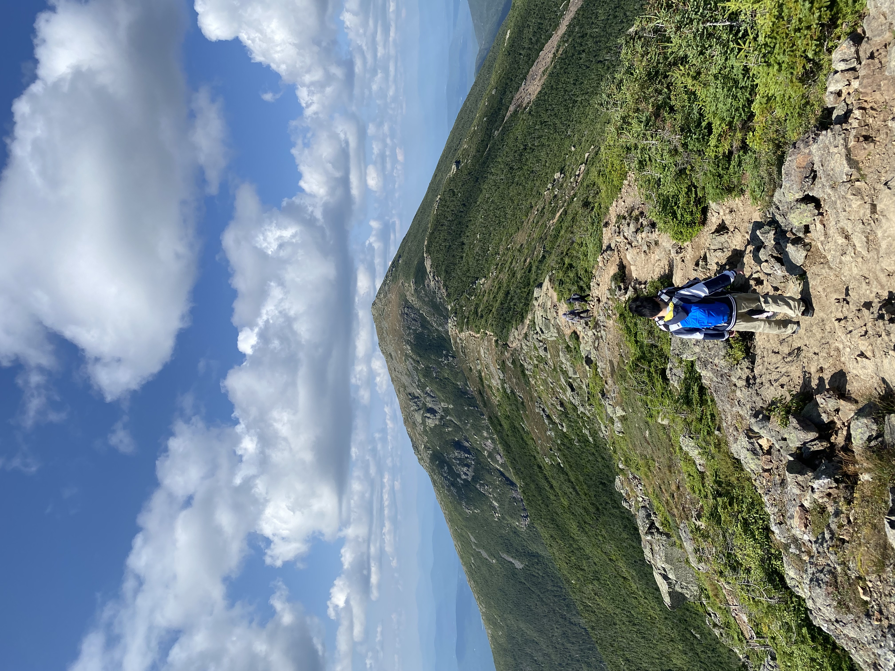
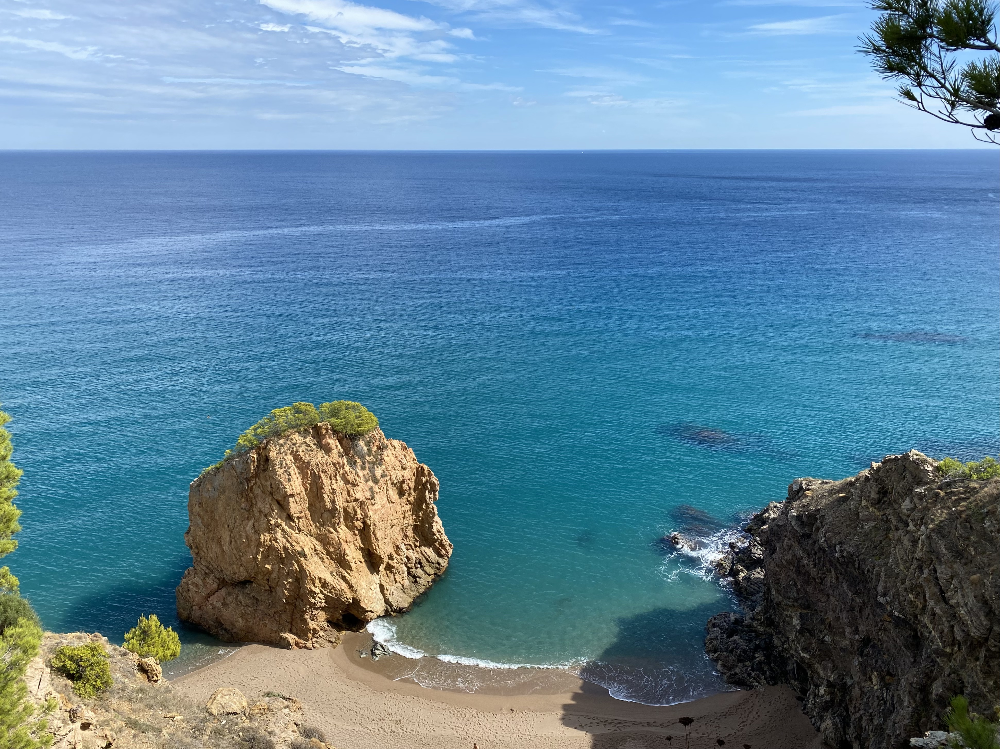
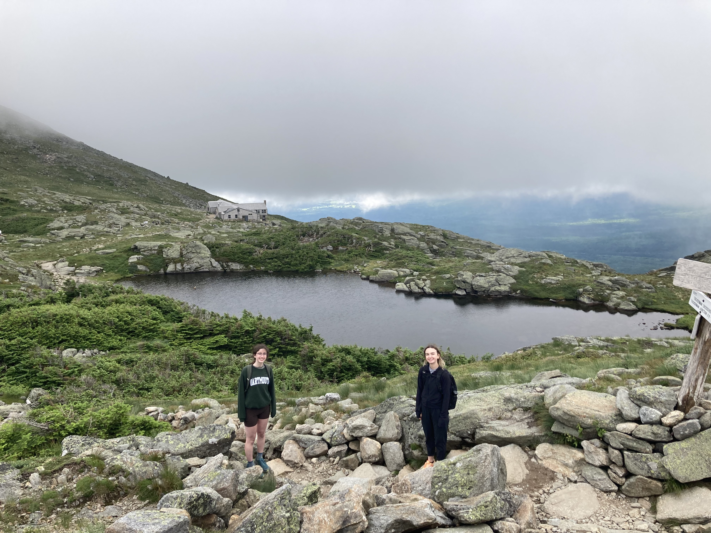
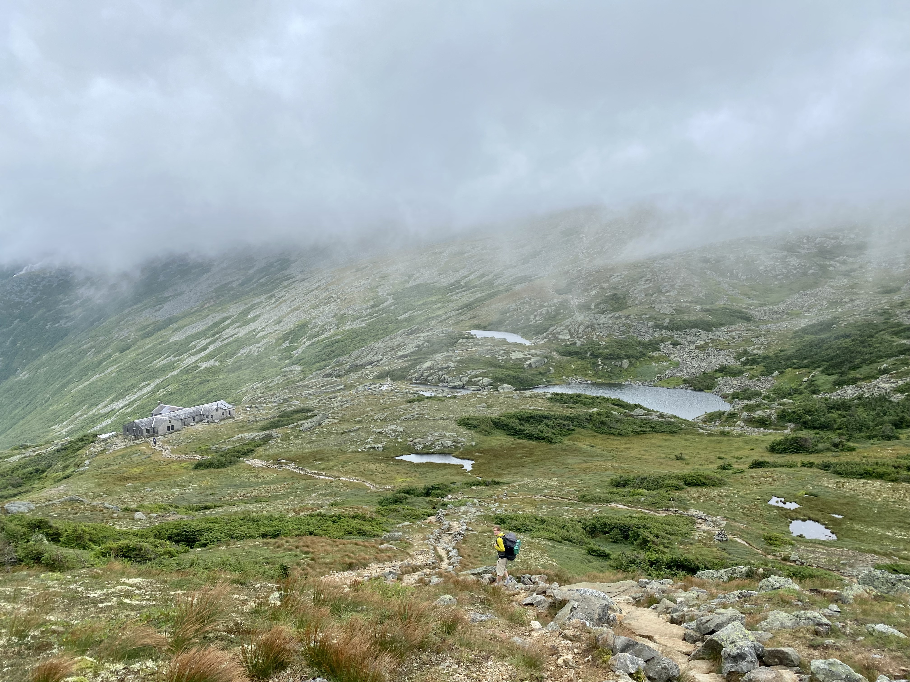
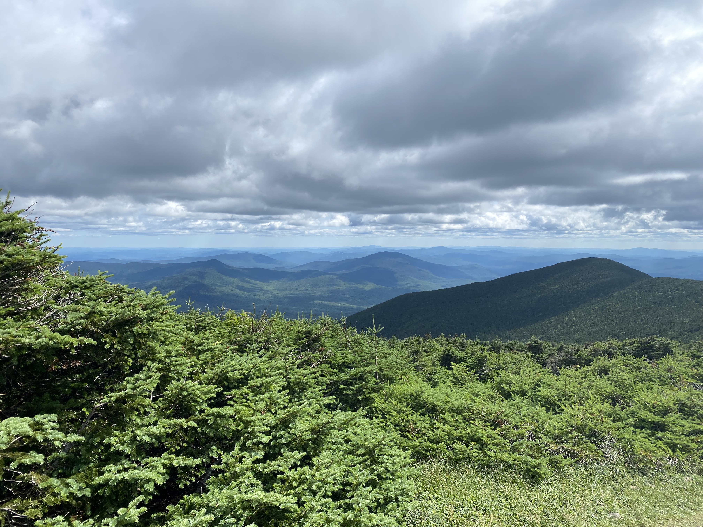

Selected favorite hikes:

## Franconia Ridge (New Hampshire, US)

During the summer of 2023, my REU cohort spent a lot of time together, even outside our research interactions. We went on eight hikes together during our ten-week program, increasing nearly monotonically in ambitiousness. Our final hike, in the middle of August, led us to Franconia Ridge. One of my friends took the picture where I'm standing on the third of four peaks we crossed while traversing the ridge.

{align="center": style="height:500;width:500px"}
{align="center":style="height:250;width:250px"}

## PRC04 FAI - Caldeira (Faial, Açores, PT)

Unfortunately, I don't have pictures ... this was when I was 13 years old and didn't have a smartphone. Instead, here's the [AllTrails listing.](https://www.alltrails.com/trail/portugal/azores/prc04-fai-caldeira)

## Camí da Ronda (Sa Tuna / Sa Riera, Catalunya, ES)
{align="center":style="height:500;width:500px"}

Technically, this is a path paved with stones, but it still felt a bit adventurous because the path was built into a cliffside. I was fortunate enough to visit on a gorgeous day towards the end of September 2022, when the Mediterranean was glowing.

## Mount Monroe via the Ammonoosuc Ravine Trail and Lakes of the Clouds Hut (New Hampshire, US)
I actually did two very similar hikes stemming from the Ammonoosuc Ravine Trail about three weeks apart, during the summer of 2023. Towards the end of July, I hiked to the Hut with a couple REU friends. It was so amazing that I returned to the area in early August with my brother. This time, we turned south at the hut and trekked up a little spur to Mount Monroe. 
{align="center":style="height:500;width:500px"}

My friend Nancy took a picture of me and my friend Marissa on the trail leading northeast of the Appalachian Mountain Club hut

{align="center":style="height:500;width:500px"}
Looking down at the Hut from the flank of Mount Monroe

## Mount Moosilauke, (New Hampshire, US)

I did my undergrad studies at Dartmouth, which runs a lodge at the base of Mount Moosilauke. Until I hiked the mountain at the end of July 2023 with some REU friends, strangely enough I'd only been to the lodge once before, for a school trip. 

{align="center":style="height:500;width:500px"}