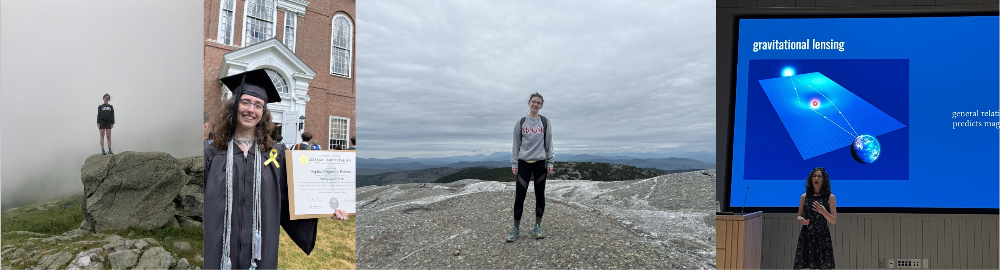
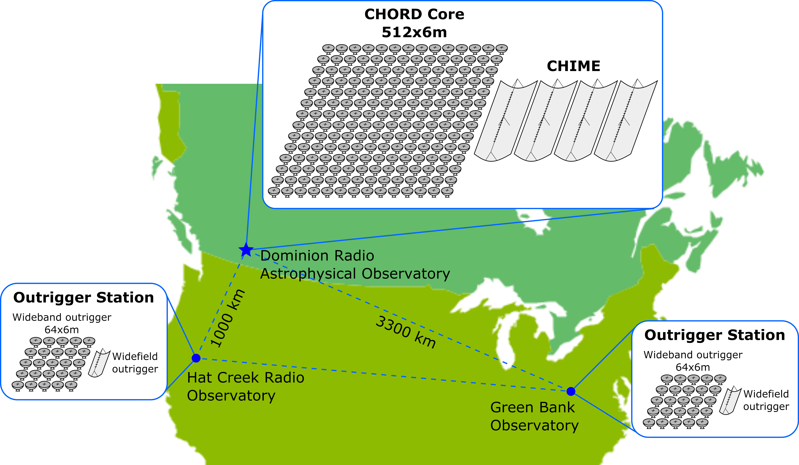

My name is Sophia. I'm a first-year direct-entry physics PhD student studying 21-cm hydrogen intensity mapping.

{align="center": style="height:250;width:1000px"}

Here are a couple personal photos. From left to right: 

* standing on a boulder next to the Lakes of the Clouds Hut overlooking the Amonoosuc Ravine (hike with some research friends)
* the photo my mom took of me standing with my undergrad diploma on graduation day
* standing on top of Mount Cardigan in New Hampshire during a solo hike
* presenting my undergraduate honors thesis (on a gravitationally lensed blazar—more info is available [here](./research/highlights/undergraduate_honors_thesis/index.md))

## Overview

As a cosmologist in training, curiosity about the implications of the physics governing the largest scales and earliest times of the universe drives my everyday work and long-term aspirations to work as a permanent researcher at an independent research institute. 

Working at the intersection of the [McGill Radio Lab](https://www.physics.mcgill.ca/~chiang/) and [McGill Cosmic Dawn Group](https://www.physics.mcgill.ca/~acliu/), I explore mainly [21 cm hydrogen](https://en.wikipedia.org/wiki/Hydrogen_line) (see the equation and discussion below, as well as [this](https://arxiv.org/abs/1907.08211) review paper) intensity mapping, with an eye towards the burgeoning [Canadian Hydrogen Observatory and Radio-Transient Detector (CHORD)](https://www.chord-observatory.ca/home).

## Signal of interest

This relative occupance equation lies at the heart of the ground-state hydrogen spin flip transition with a 21 cm wavelength. This transition is classically forbidden, but the overwhelming abundance of hydrogen in the universe (of the ~5% of the universe comprising baryonic ("everyday") matter, ~75% of this is hydrogen) means that the signal is relatively strong.

$$\frac{n_1}{n_0}=3\exp{\frac{h}{k_B}\frac{\nu_{21}}{T_s}}$$ 

## Website philosophy

As a graduate student, I am at the crossroads of my career. I am no longer the undergraduate at a liberal arts college that I once was. Since then, I have grown as a researcher and developed more clarity in my research goals. I am also not yet the fully-fledged experienced researcher I strive to be. Graduate school is my test bed for developing new programming, hardware, collaboration, communication, and teaching skills. At this crossroads, I am exploring avenues such as this website for forging new professional presence and connectivity. 

In other sections of this site, I dive further into [my research](./research/index.md), [recent projects](./projects/index.md) and [background](./about/index.md).

## CHORD map

{align="center": style="height:1000;width:1000px"}

Image source: [CHORD Wiki](https://chord.mywikis.wiki/wiki/Useful_Graphics).

CHORD is a drift-scan telescope, meaning it cannot be mechanically configured to point at different areas of the sky. Instead, it views different parts of the sky as the earth rotates. It is an interferometer, meaning the data processing pipeline includes signal processing concepts such as aperture synthesis and beam forming (to learn more about radio interferometer data processing, I recommend [this](https://www.cv.nrao.edu/~sransom/web/xxx.html) e-textbook) to mimic the effect of a larger telescope dish without directly confronting the associated technical challenges. In contrast to often-discussed very-long baseline interferometry (VLBI) telescopes such as the Event Horizon Telescope (EHT) which are used for—among other things—imaging, CHORD is designed with power spectrum creation in mind, and benefits from the higher signal-to-noise ratio (SNR) resulting from a relatively dense network of short baselines. Still, its uv-coverage is supplemented by observing jointly at the CHORD core and outlying outrigger stations. 

## Contact
Email: sophia.rubens@mail.mcgill.ca

Office: 208 Rutherford Physics Building, 3600 Rue University, Montréal, QC, H3A 2T8