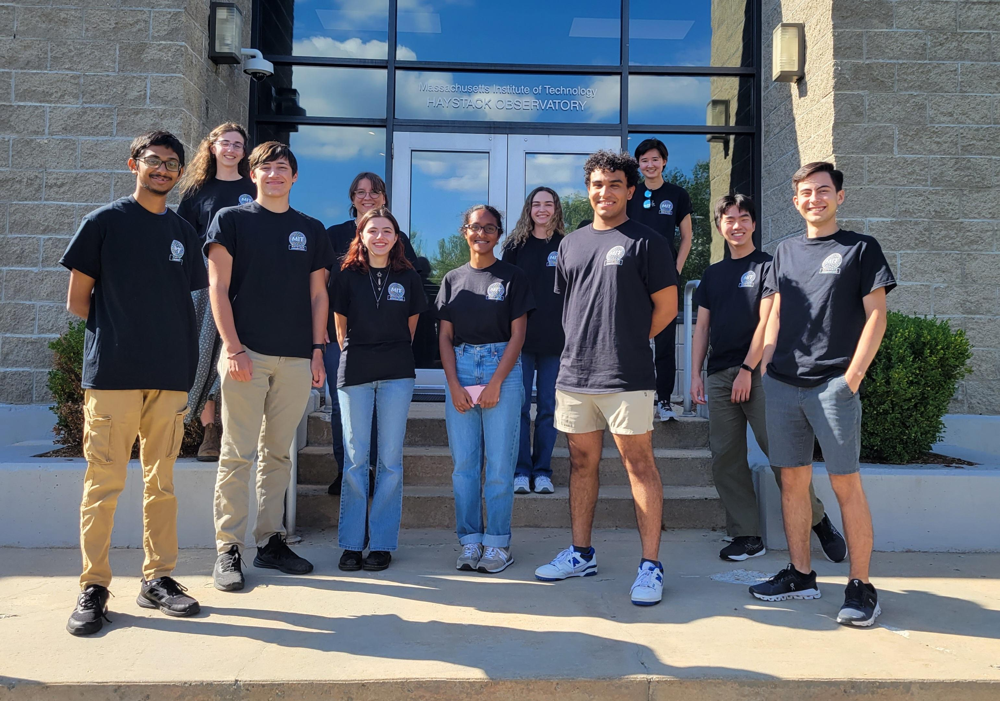
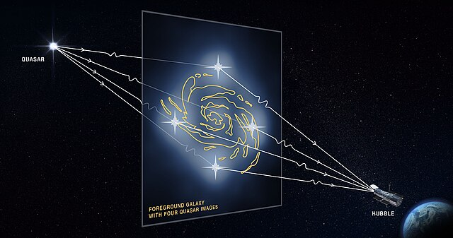

# REU report

I wrote my first not-for-a-class scientific report as a participant in the MIT Haystack Observatory Research Experience for Undergraduates (REU) during the summer of 2023. I used radio-frequency (VLBI, for imaging; and single-dish, for time-monitoring light curves and spectroscopy) and gamma-ray (light curves from the Fermi telescope, for comparison with their radio counterparts) data to construct a case study of the [gravitationally lensed](https://en.wikipedia.org/wiki/Strong_gravitational_lensing) [blazar](https://en.wikipedia.org/wiki/Blazar) [PKS 1830-211](https://en.wikipedia.org/wiki/PKS_1830-211). For context, a blazar is one "flavor" of active galaxy where the characteristic intense multi-frequency emission from the relativistic jet perpendicular to the accretion disk is radio-loud. Within the unified model of active galactic nuclei (AGNs), a blazar is an AGN viewed nearly face-on. 

My radio interferometric data came from the [Korean VLBI Network (KVN)](https://radio.kasi.re.kr/kvn/main.php), my radio light curves came from the [Caltech Owens Valley Radio Observatory (OVRO)](https://ovro.caltech.edu), and my gamma-ray light curves came from the [Fermi space telescope](https://fermi.gsfc.nasa.gov/). Due to the condensed ten-week timeframe of the REU program, I did not write observing proposals or otherwise participate in the data acquisition process—rather, my primary advisor provided me with data and relevant context, as necessary. 

I worked on this REU project between June and August of 2023. By the end of this period, I believed I'd tentatively identified a physically meaningful periodicity in the PKS 1830-211 light curve and a physically meaningful time delay between radio and gamma-ray emission, which I (incorrectly, and based on a misinterpretation of the literature) claimed was consistent with a plasmon (i.e. traveling shock-in-jet) model of blazar jet emission. At this point, I'd also discussed the possibility of performing molecular spectral line analysis for the PKS 1830-211 system with my advisor, but failed to make headway over the course of the summer. I later revisited all of these conclusions and identified several spectral lines during the process of preparing my undergraduate honors thesis.

The associated slide presentation and poster I prepared are both linked under the "Using a Natural Cosmic Telescope to Study a Distant Radio Quasar / Sophia D'Agostino Rubens" heading (eighth from the top) under 2023 tab of the [Haystack REU presentation archive](https://www.haystack.mit.edu/haystack-public-outreach/research-experiences-for-undergraduates-reu/reu-presentation-archives/).

{align="center": style="height:432px;width:616px"}

Photo with my REU cohort on the last day of the program. We've kept in touch via Discord and are always scheming about REUnions at conferences

<figure markdown>
  {: style="height:300px;width:500px"}
  <!-- Within fig caption normal markdown linking doesn't work, instead use a href attribute -->
  <figcaption>Schematic representation of the strong gravitational lensing of an active galaxy by an intervening galaxy. In practice, imperfect source-lens-observer alignment means only two of the four theoretical images have appreciable brightness compared to the background. (source: <a href="https://upload.wikimedia.org/wikipedia/commons/thumb/a/a9/Illustration_of_Strong_Gravitational_Lensing_%282020-05-4617%29.jpg/1600px-Illustration_of_Strong_Gravitational_Lensing_%282020-05-4617%29.jpg?20240117011630">Wikimedia Commons</a>) </figcaption>
</figure>
