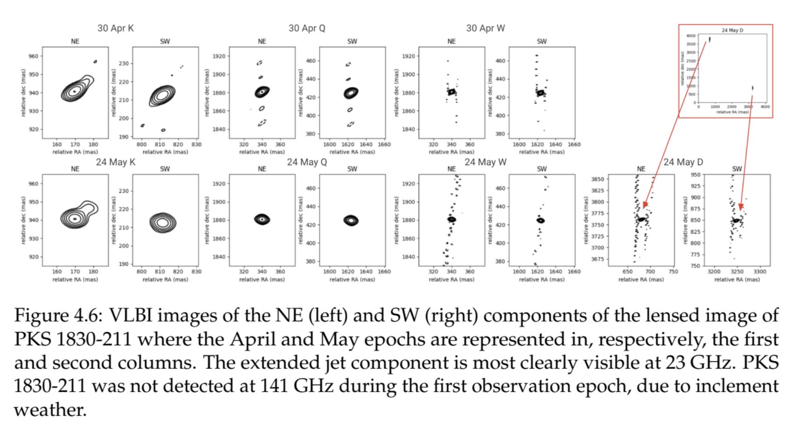

# Undergraduate honors thesis

My undergraduate honors thesis expanded upon the case study of the [gravitationally lensed](https://en.wikipedia.org/wiki/Strong_gravitational_lensing) [blazar](https://en.wikipedia.org/wiki/Blazar) [PKS 1830-211](https://en.wikipedia.org/wiki/PKS_1830-211) I conducted during my time as a student in the research experience for undergraduates (REU) program at [MIT Haystack Observatory](https://www.haystack.mit.edu). For context, a blazar is one "flavor" of active galaxy where the characteristic intense multi-frequency emission from the relativistic jet perpendicular to the accretion disk is radio-loud. Within the unified model of active galactic nuclei (AGNs), a blazar is an AGN viewed nearly face-on. For more context on this project and a contextualization of where my analysis after those ten initial weeks of work fell short, please see the [corresponding page](/graduate-studies/research/highlights/reu_report/).

In this thesis, I qualitatively confirm the trends I found in the flux ratios between the NE and SW components of the lensed image of PKS 1830-211, but reinterpret these values according to an updated reading of the literature to conclude that the plasmon (i.e. traveling shock-in-jet) model is still a plausible explanation for the mechanism powering the jet of the quasar in PKS 1830-211, but clarify that this qualifies as a cospatial emission model—meaning emission at different frequencies does not arise from fundamentally different regions of the jet. This conclusion is enhanced by my new result that all possible radio-gamma time delays I might have found during the REU are statistically insignificant.

I also re-examine the time-monitoring light curves for the lensed system using more sophisticated validation techniques and find that all periods potentially indicated by a periodogram analysis are statistically insignificant. I used time series folding and folding perturbation to reach this conclusion. Consequently, I cast doubt on the possibility that the jet of the blazar in PKS 1830-211 is precessing with respect to the line of sight, a finding first proposed by [Nair et al (2005)](https://ui.adsabs.harvard.edu/abs/2005MNRAS.362.1157N/abstract) and commonly referenced thereafter though not, to my knowledge or after my literature review of order 100 papers on PKS 1830-211, ever independently confirmed.

Finally, I identify some molecular transitions in one of the nearly face-on spiral galaxies lensing the source blazar. Although the z=0.19 galaxy does not exhibit any known molecular transitions, the z=0.89 galaxy exhibits over thirty known such transitions. In the data set I had available, I identified five distinct lines: four relatively confidently and echoing literature findings, and one where the only good match available in the [Splatalogue](https://splatalogue.online/#/home) was an implausibly large molecule.

Shown below is a compilation of my VLBI imaging results. After using the [Astronomical Image Processing System (AIPS)](http://www.aips.nrao.edu) to reduce and calibrate my data and the [Caltech software implementation of the difference mapping technique (difmap)](https://www.cv.nrao.edu/adass/adassVI/shepherdm.html) to prepare the images shown below, I used difmap to perform model fitting and extract the flux values used to construct the ratios I considered in the quantitative part of my VLBI analysis. 
{align="center": style="height:1000;width:1000px"}

{align="center": style="height:500;width:500px"}

Photo with my thesis committee after my defense